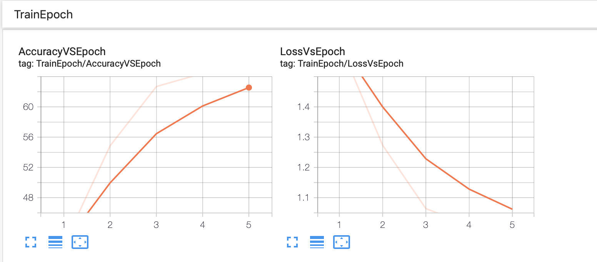
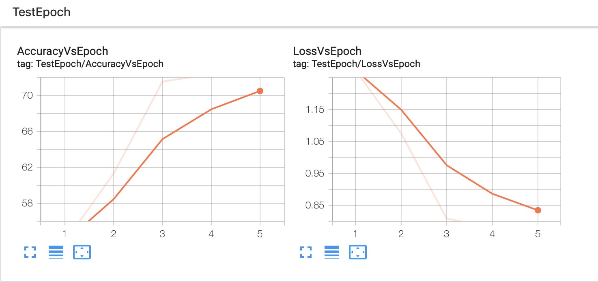

#Experiment summary 

First of all, there were added several graphs to tensor board, which shows us the dependencies loss vs epochs and accuracy vs epoch for training. 
          
         
Also, there is illustrated accuracy vs epoch for test data, where we evaluated the trained model.
 
In the graphs above, we can notice how loss decrease and accuracy increase for next epochs.
Moreover, accuracy for train and test data increase simultaneously 

### Modified  neural net
The proposed neural network is so close to LeNet5 architecture. 
To increase accuracy, there were added one additional convolution layer, batch normalization and also there were increased filter sizes.<br>
See the code of modified neural net below:
```
class Net(nn.Module):
    def __init__(self):
        super(Net, self).__init__()
        self.conv1 = nn.Conv2d(3, 16, 5)
        self.batch_norm1 = nn.BatchNorm2d(16)
        self.pool = nn.MaxPool2d(2, 2)
        self.conv2 = nn.Conv2d(16, 32, 5)
        self.batch_norm2 = nn.BatchNorm2d(32)
        self.conv3 = nn.Conv2d(32, 64, 2)
        self.batch_norm3 = nn.BatchNorm2d(64)
        self.fc1 = nn.Linear(64 * 2 * 2, 256)
        self.fc2 = nn.Linear(256, 120)
        self.fc3 = nn.Linear(120, 10)
        
        
    def forward(self, x):
        x = self.batch_norm1(F.relu(self.conv1(x)))
        x = self.pool(x)
        x = self.batch_norm2(F.relu(self.conv2(x)))
        x = self.pool(x)
        x = self.batch_norm3(F.relu(self.conv3(x)))
        x = self.pool(x)
        x = x.view(-1, 64 * 2 * 2)
        x = F.relu(self.fc1(x))
        x = F.relu(self.fc2(x))
        x = self.fc3(x)
        return x             
```
Of course, firstly, there were tried to set others parameters for filter size, number of filters but it gave worse accuracy. 
So using the cnn with these parameters gave about 73% accuracy on test data, so I decided to stay it. 
Accuracies for each classes are defined below:
```
Accuracy of plane : 79 %
Accuracy of   car : 86 %
Accuracy of  bird : 58 %
Accuracy of   cat : 51 %
Accuracy of  deer : 68 %
Accuracy of   dog : 58 %
Accuracy of  frog : 84 %
Accuracy of horse : 76 %
Accuracy of  ship : 86 %
Accuracy of truck : 82 %
```
###Comparing training time CPU vs GPU
CPU training time for this model was 11 min 52 s (~ 12 min) and GPU training time was 6 min 36 s. 
As it was expected training CNN model on GPU is faster than on CPU, because there a lot of matrix operation which are parallel distributed on GPU computation.

###Future improvements 
This is one of the most simple way how to improve provided model. In the next steps, it would be great to try use 
different optimizer and sceduler with different parameters (lr and momentum in optimizer and step_size and gamma in scheduler).
Maybe, some parameters would be good to find via RandomSeach approach (train and test model with different parameters and select these which give the best accuracy).<br>
Also, changing augmentation can give better result. <br>
Furthermore, it would be interesting to check other CNN architecture like AlexNet, VGG, GoogLeNet. ResNet.
Probably, these models give significantly better accuracy. <br>

___

 *The experiment was done in the original provided notebook, to see this modified notebook with more details about experiment result, please look Experiment_a3_cifar10.ipynb*


