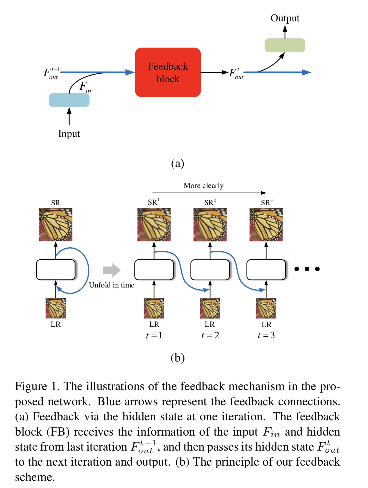
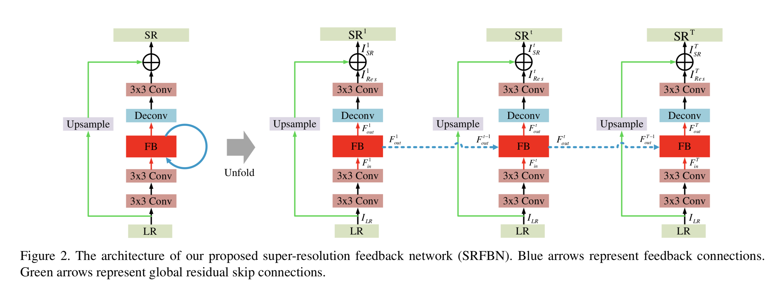
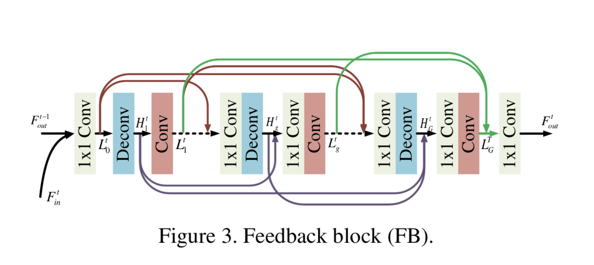
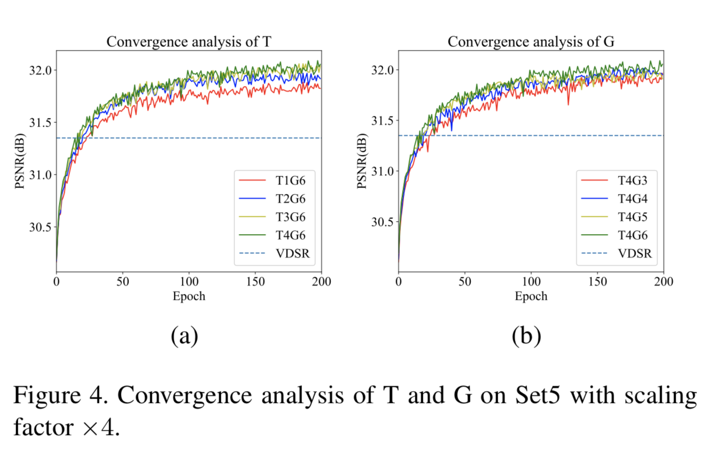
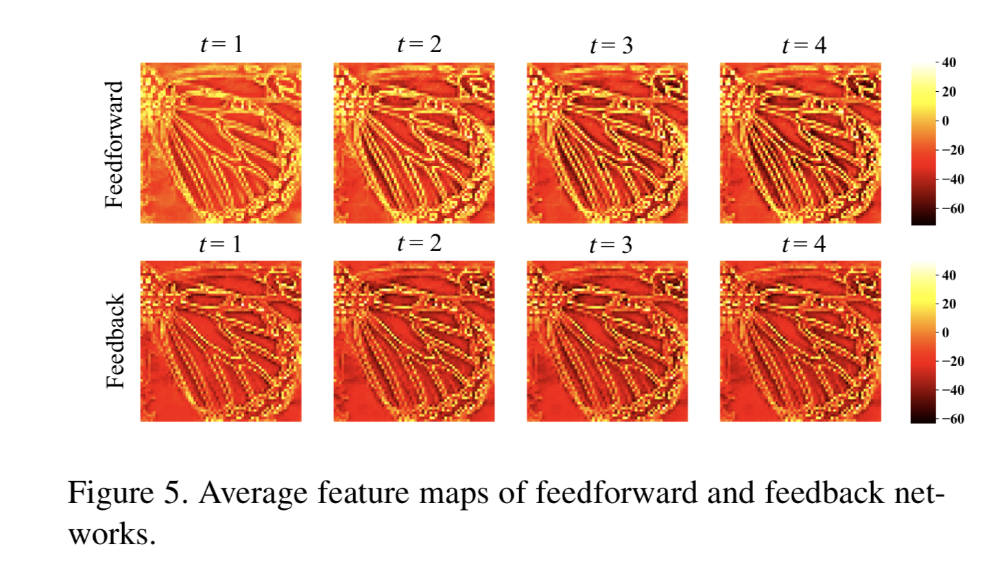
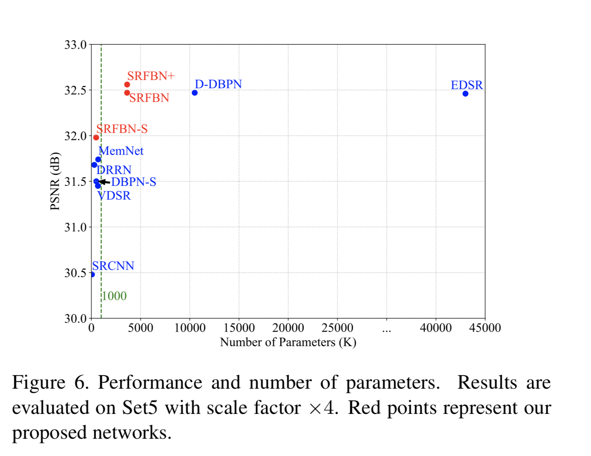
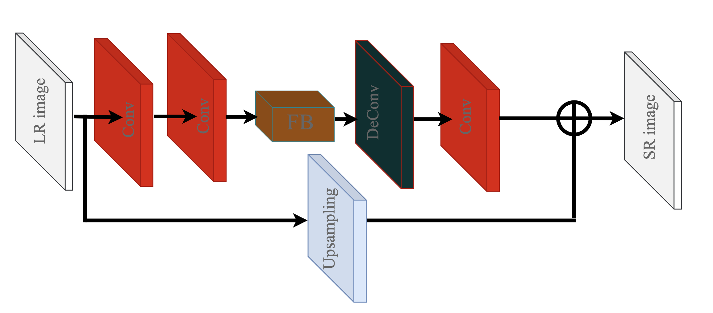
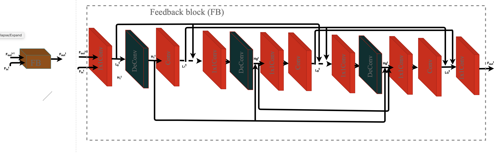

# Deep Learning for Computer Vision - Homework 5

## 1. Paper review 
### Paper

* **Title**: Feedback Network for Image Super-Resolution
* **Authors**: Zhen Li, Jinglei Yang, Zheng Liu, Xiaomin Yang, Gwanggil Jeon, Wei Wu
* **Link**: http://openaccess.thecvf.com/content_CVPR_2019/papers/Li_Feedback_Network_for_Image_Super-Resolution_CVPR_2019_paper.pdf
* **Tags**: SRFBN, LR, HR, SR, CNN
* **Year**: 2018

### Summary

* What
  * They propose an image super-resolution feedback network (SRFBN) to create the final high-resolution image
  * There is introduced a curriculum learning strategy to make the network well suitable, where initial images are corrupted
  * Feedback approach allows to reduce memory usage cased by other deep learning methods  
  * There is provided comparison between SRFBN and state of the art methods. 

* How
  * Image super resolution 
    * The aim of image super resolution is reconstruction a high-resolution (HR) image from its low resolution (LR) counterparts. 
    * There is also proposed numerous methods like interpolation-based methods, reconstruction-based methods and learning-based methods.
    * Deep learning in super resolution has advantages and disadvantages. 
    The benefits mainly come from depth (powerful capability to represent and establish more complex LR-HR mapping) and skip connections (can effectively alleviate the gradient exploding problems caused by staken more layers to deepen networks). 
    The disadvantages are that depth of networks grows, number of parameters increases, it occupies huge storage resource and cause to overfitting problem.
  * Deep learning based image super resolution 
    * In this paper, there is mention that firstly a three-layer CNN was introduced to solve super resolution problem. 
    Also, it was increased the depth to 20 layers to learn a complex LR-HR mapping. 
    As a result it overcomes the difficulty of optimization when the network become deeper. 
    * To combine hierarchical features in a bottom-up way there is used skip connections in network architectures, such as SRRestNet and EDSR.
     So, the low-level features can receive the information from previous layer lacking enough contextual information due to the limitation of small receptive fields.
     These low-level features are reused in the following layers, and thus further restrict the reconstruction ability of the network.
    * To fix the previous issue, they propose a super-resolution feedback network (SRFBN), in which high-level information flows through feedback connections in a top-down manner to correct low-level features using more contextual information.
    * Skipping connection allows neural net to go deeper and hold more parameters. As large capacity networks occupy huge amount of storage, recurrent structure allows to reduce network parameters. 
    Furthermore, the recurrent structure plays an important role to realize the feedback process in the proposed SRFBN.
  * Feedback mechanism 
    * The feedback mechanism allows the network to carry a notion of output to correct previous states. 
    * Integration feedback mechnism into neural net for super resolution problem showed some efforts. 
    * To fit feedback mechanism in image super resolution, they elaborate design a feedback block as a basic module in their SRFBN, instead of using ConvLSTM. 
    * Some experiments results shows that feedback block has superior reconstruction performance.
    * In the figure bellow, there is illustrated feedback mechanism for SRFBN
         
  * Feedback Network for Image SR 
    * Feedback system contains two requirements: iterativeness and rerouting the output of the system to correct the input in each loop. 
    * In the SRFBN there three indispensable parts to enforce feedback scheme: <br>
        1) tying the loss at each iteration (to force the network to reconstruct an SR image at each iteration and thus allow the hidden state to carry a notion of high-level information), 
        2) using recurrent structure (to achieve iterative process) 
        3) providing an LR input at each iteration (to ensure the availability of low-level information, which is needed to be refined).
    * Network architecture is illustrated in the Figure 2 below     
        
    * Proposed SRFBN can be unfolded to T iterations, in which each iteration t is temporally ordered from 1 to T.
    In order to make the hidden state in SRFBN carry a notion of output, we tie the loss for every iteration
    * At each iteration sub-network placed three parts: an LR feature extraction block (LRFB), a feedback block (FB), and a reconstruction block (RB).
    * The purpose of the sub-network at each iteration is to recover residual image from input a low resolution image
    * In the Figure 3, there is illustrated one iteration process by feedback block.
         
        The FB contains G projection groups sequentially with dense skip connections among them. Each projection group, which can project HR features to LR ones, mainly includes an upsample operation and a downsample operation.
    * Curriculum learning strategy was used to choose loss function and optimize it. 
    * PReLU was used as the activation function following all convolutional and deconvolutional layers except the last layer in each sub-network 

* Experimental result
  * Settings
    * There were used DIV2K and Flickr2K as their training data
    * There were evaluated SR results under PSNR and SSIM[39] metrics on five standard benchmark datasets: Set5[3], Set14[41], B100[24], Urban100[15], and Manga109[25].
    * In order to make fair comparison with existing models, they regard bicubic downsampling as their standard degradation model (denoted as BI) for generating LR images from ground truth HR images.
    * All networks were trained with batch size of 16 
    * Study T and G. They explored the influence of the number of iterations (denoted as T) and the number of projection groups in the feedback block (denoted as G).
    In the Figure 4 below, there is illustration how reconstruction performance significantly improved compared  with the network without feedback connection (T=1, see (s)) and how large G leads to higher accuracy due to stronger representative ability of deeper networks (see (b)).
    In conclusion, choosing larger T or G both con- tribute to better results.
      
    
  * Feedback vs feedforward.
    To dig deeper into the difference between feedback and feedforward networks, there is  visualization the average feature map of every iteration in SRFBN-L and SRFBN-L-FF, illustrated in Fig. 5 bellow
    
  * Comparison with the state-of-the-arts. 
  The SRFBN with a larger base number of filters (m=64), which is derived from the SRFBN-L, is implemented for comparison.
  The state-of-the-art methods considered in this experiment include SRCNN[7], VDSR[18], DRRN[31], MemNet[36], EDSR[23], DBPN-S[11] and D-DBPN[11]. The com- parison results are given in Fig. 6 in terms of the network parameters and the reconstruction effects (PSNR).
        *
   
   Moreover, in the paper, there are provided comparison with  BI degradation model and BD and DN degradation models.
   
* Conclusion <br>
Overall, in this paper, they propose a novel network for image SR called super-resolution feedback network (SRFBN) to faithfully reconstruct a SR image by enhancing low-level representations with high-level ones.

##2. CNN visualization
In the image bellow, we can see the visualization of Super-Resolution Feedback Network (SRFBN). The original visualization is in SRFBN.drawio file.
        
        
        
##3. Experiment summary
###Experiment summary 

First of all, there were added several graphs to tensor board, which shows us the dependencies loss vs epochs and accuracy vs epoch for training. 
          
         
Also, there is illustrated accuracy vs epoch for test data, where we evaluated the trained model.
 
In the graphs above, we can notice how loss decrease and accuracy increase for next epochs.
Moreover, accuracy for train and test data increase simultaneously 

#### Modified  neural net
The proposed neural network is so close to LeNet5 architecture. 
To increase accuracy, there were added one additional convolution layer, batch normalization and also there were increased filter sizes.<br>
See the code of modified neural net below:
```
class Net(nn.Module):
    def __init__(self):
        super(Net, self).__init__()
        self.conv1 = nn.Conv2d(3, 16, 5)
        self.batch_norm1 = nn.BatchNorm2d(16)
        self.pool = nn.MaxPool2d(2, 2)
        self.conv2 = nn.Conv2d(16, 32, 5)
        self.batch_norm2 = nn.BatchNorm2d(32)
        self.conv3 = nn.Conv2d(32, 64, 2)
        self.batch_norm3 = nn.BatchNorm2d(64)
        self.fc1 = nn.Linear(64 * 2 * 2, 256)
        self.fc2 = nn.Linear(256, 120)
        self.fc3 = nn.Linear(120, 10)
        
        
    def forward(self, x):
        x = self.batch_norm1(F.relu(self.conv1(x)))
        x = self.pool(x)
        x = self.batch_norm2(F.relu(self.conv2(x)))
        x = self.pool(x)
        x = self.batch_norm3(F.relu(self.conv3(x)))
        x = self.pool(x)
        x = x.view(-1, 64 * 2 * 2)
        x = F.relu(self.fc1(x))
        x = F.relu(self.fc2(x))
        x = self.fc3(x)
        return x             
```
Of course, firstly, there were tried to set others parameters for filter size, number of filters but it gave worse accuracy. 
So using the cnn with these parameters gave about 73% accuracy on test data, so I decided to stay it. 
Accuracies for each classes are defined below:
```
Accuracy of plane : 79 %
Accuracy of   car : 86 %
Accuracy of  bird : 58 %
Accuracy of   cat : 51 %
Accuracy of  deer : 68 %
Accuracy of   dog : 58 %
Accuracy of  frog : 84 %
Accuracy of horse : 76 %
Accuracy of  ship : 86 %
Accuracy of truck : 82 %
```
####Comparing training time CPU vs GPU
CPU training time for this model was 11 min 52 s (~ 12 min) and GPU training time was 6 min 36 s. 
As it was expected training CNN model on GPU is faster than on CPU, because there a lot of matrix operation which are parallel distributed on GPU computation.

####Future improvements 
This is one of the most simple way how to improve provided model. In the next steps, it would be great to try use 
different optimizer and sceduler with different parameters (lr and momentum in optimizer and step_size and gamma in scheduler).
Maybe, some parameters would be good to find via RandomSeach approach (train and test model with different parameters and select these which give the best accuracy).<br>
Also, changing augmentation can give better result. <br>
Furthermore, it would be interesting to check other CNN architecture like AlexNet, VGG, GoogLeNet. ResNet.
Probably, these models give significantly better accuracy. <br>

___

 *The experiment was done in the original provided notebook, to see this modified notebook with more details about experiment result, please look Experiment_a3_cifar10.ipynb*


